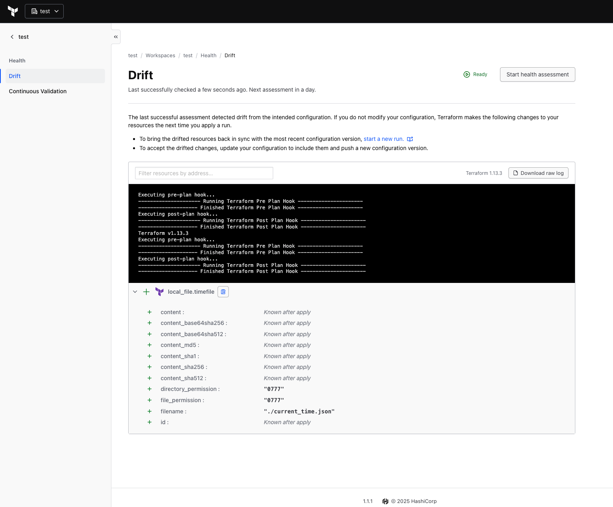
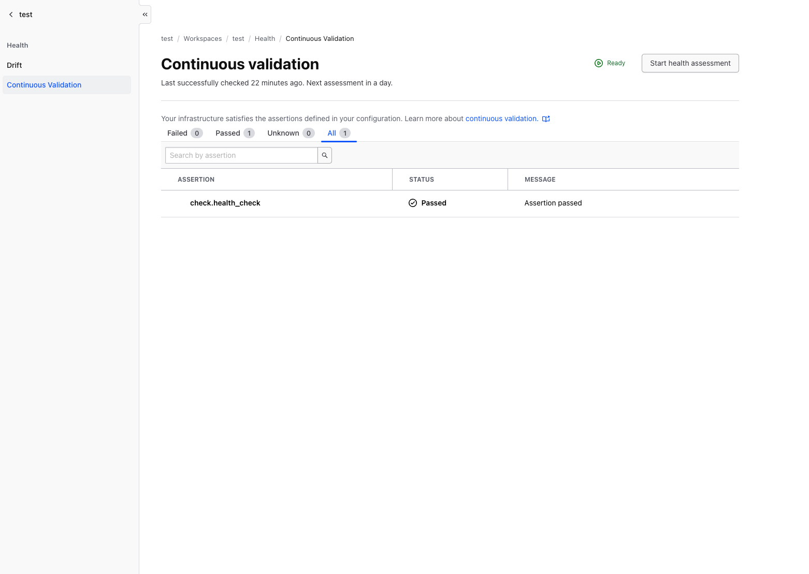

# Terraform Drift Detection & Health Check Example

This repository demonstrates how **drift detection** and **health checks** work in Terraform Enterprise (TFE) and HCP Terraform.

## 📋 Overview

This example showcases two key Terraform features:

1. **Drift Detection**: Monitors changes to infrastructure that occur outside of Terraform
2. **Health Checks**: Validates that external dependencies and resources are functioning correctly

## 🔍 How It Works

### Drift Detection

The configuration creates a local file with a timestamp that continuously changes:

```hcl
resource "local_file" "timefile" {
  filename = "${path.module}/current_time.json"
  content  = timestamp()
}
```

Because the `timestamp()` function generates a new value on each run, this resource will **always show drift** in Terraform Enterprise, making it perfect for demonstrating and testing drift detection features.

### Health Check

The configuration includes a health check that validates external service availability:

```hcl
check "health_check" {
  data "http" "terraform_io" {
    url = "https://www.terraform.io"
  }

  assert {
    condition = data.http.terraform_io.status_code == 200
    error_message = "${data.http.terraform_io.url} returned an unhealthy status code"
  }
}
```

This health check verifies that `https://www.terraform.io` is accessible and returns a 200 status code. You can modify this condition to force an error and see how TFE handles failed health checks.

## 🚀 Usage

### Prerequisites

- Terraform >= 1.5.0 (for `check` block support)
- Terraform Enterprise or HCP Terraform workspace configured
- Drift detection enabled in your workspace settings

### Setup

1. Clone this repository:
   ```bash
   git clone <repository-url>
   cd drift_health_check_example
   ```

2. Initialize Terraform:
   ```bash
   terraform init
   ```

3. Apply the configuration:
   ```bash
   terraform apply
   ```

4. In Terraform Enterprise/HCP Terraform:
   - Enable drift detection on your workspace
   - Configure drift detection schedule (e.g., hourly)
   - Monitor the drift detection runs

## 📸 Screenshots

### Drift Detection in Action

The drift detection feature identifies that the local file has changed since the last apply:



### Health Check Validation

The health check validates external dependencies and displays their status:



## 🧪 Testing Scenarios

### Test Drift Detection

Since the timestamp changes on every run, drift will be detected automatically. This allows you to:
- Test drift notification workflows
- Validate drift detection scheduling
- Practice responding to drift alerts

### Test Health Check Failures

To test failed health checks, modify the assertion condition in `main.tf`:

```hcl
assert {
  condition = data.http.terraform_io.status_code == 404  # This will fail
  error_message = "${data.http.terraform_io.url} returned an unhealthy status code"
}
```

## 📚 Learn More

- [Terraform Enterprise Drift Detection Documentation](https://developer.hashicorp.com/terraform/cloud-docs/workspaces/health)
- [Terraform Check Blocks](https://developer.hashicorp.com/terraform/language/checks)
- [Custom Conditions and Validation](https://developer.hashicorp.com/terraform/language/expressions/custom-conditions)

## 📄 License

See [LICENSE](LICENSE) file for details.

---

**Note**: This is an educational example designed to demonstrate TFE features. In production environments, you would typically want your infrastructure to remain in sync with your Terraform state!   